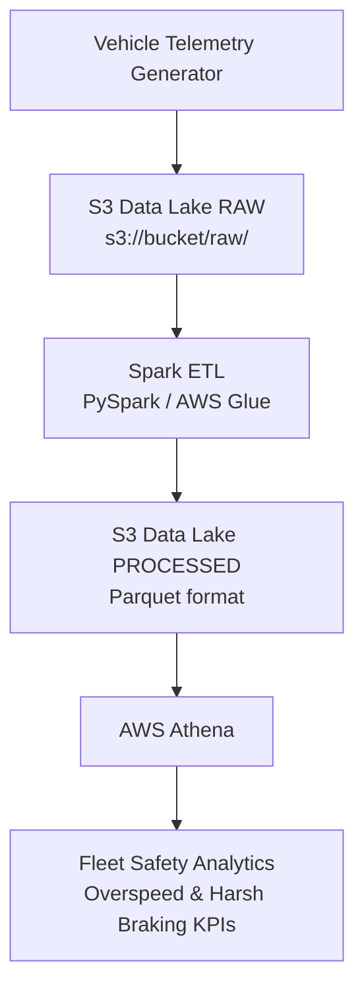
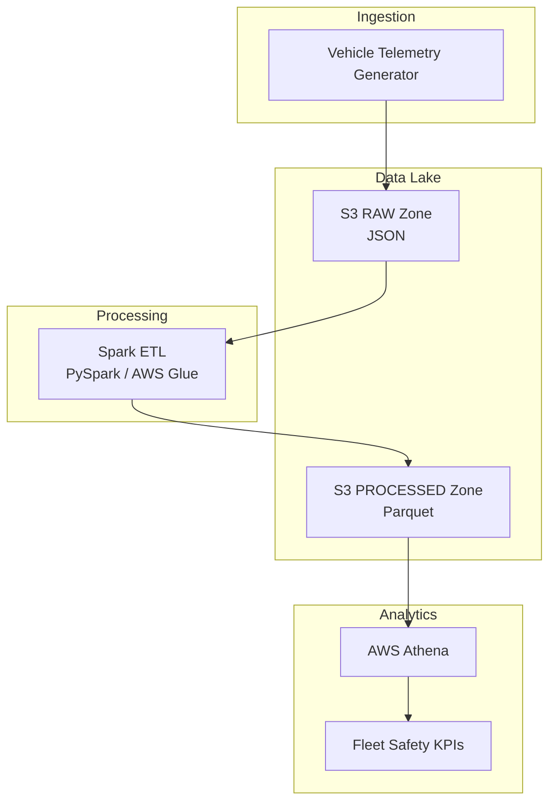
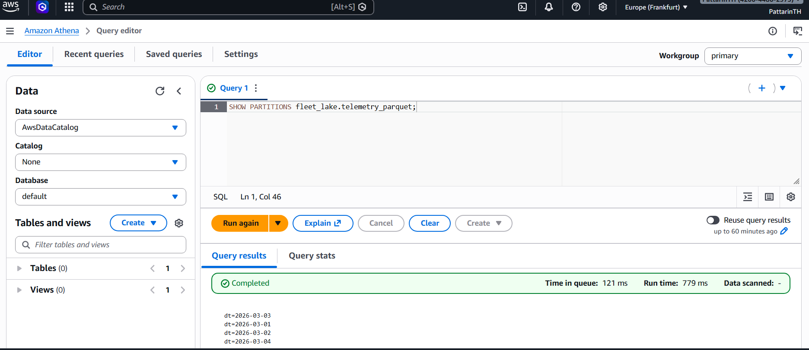
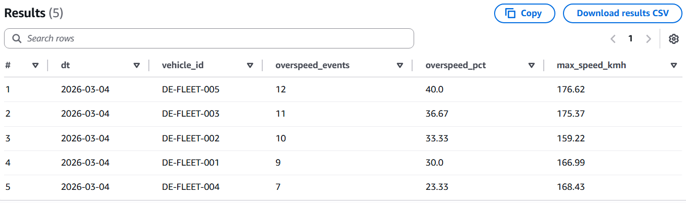
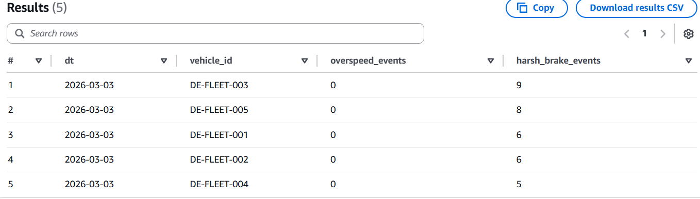

# Fleet Telemetry Data Lake (AWS S3 + Spark + Athena)

## Project Goal
Build a lightweight **fleet telemetry data lake** that supports scalable analytics (fleet safety KPIs, driving behavior signals) using AWS Free Tier–friendly services.

This project simulates vehicle telemetry and demonstrates how raw telemetry can be ingested, processed, and queried using modern cloud data lake architecture.

---
## Project Structure
```
fleet-telemetry-data-lake/
│
├── data/
│   ├── local_raw/
│   └── local_processed/
│
├── scripts/
│   └── generate_telemetry.py
│
├── spark_jobs/
│   ├── json_to_parquet_local.py
│   └── json_to_parquet_wsl_param.py
│
├── notebooks/
│
├── docs/
│
└── README.md
```
---
## Tech Stack

- AWS S3 (Data Lake Storage)
- Apache Spark / PySpark (ETL Processing)
- AWS Athena (SQL Analytics)
- Parquet (Columnar Storage)
- Python
- WSL2 (Development Environment)
---

## Architecture
```
Telemetry (JSONL)
        ↓
S3 RAW Layer
        ↓
Spark ETL (PySpark)
        ↓
S3 PROCESSED Layer (Parquet)
        ↓
Athena SQL Analytics

```
---



---

## Data Lake Layout (S3)

```
s3://fleet-datalake-pattarin/

raw/
 ├── dt=2026-03-01/
 ├── dt=2026-03-02/
 ├── dt=2026-03-03/
 └── dt=2026-03-04/

processed/
 └── telemetry/
      ├── dt=2026-03-01/
      ├── dt=2026-03-02/
      ├── dt=2026-03-03/
      └── dt=2026-03-04/
```
---


---

## Telemetry Schema

### Core fields

| column | type |
|------|------|
vehicle_id | string
event_time | timestamp
speed_kmh | double
engine_rpm | int
gps_lat | double
gps_lon | double

### Safety signals

| column | description |
|------|------|
overspeed | 1 if speed > 130 km/h
harsh_brake | 1 if speed drop ≥ 20 km/h vs previous minute

---

## Reproduce the Pipeline

### 1 Generate Telemetry

```
python scripts/generate_telemetry.py --date 2026-03-04 --vehicles 5 --minutes 30
```

Output:

```
data/local_raw/dt=2026-03-04/telemetry.jsonl
```

---

### 2 Upload Raw Data to S3

```
aws s3 cp data/local_raw/dt=2026-03-04 \
s3://fleet-datalake-pattarin/raw/dt=2026-03-04/ \
--recursive
```

---

### 3 Convert JSONL → Parquet (Spark)

```
python spark_jobs/json_to_parquet_wsl_param.py --date 2026-03-04
```

Output:

```
data/local_processed/telemetry/dt=2026-03-04/
```

---

### 4 Upload Parquet to S3 Processed Layer

```
aws s3 cp data/local_processed/telemetry/dt=2026-03-04 \
s3://fleet-datalake-pattarin/processed/telemetry/dt=2026-03-04/ \
--recursive --exclude "*.crc"
```

---

### 5 Query Using Athena

Create table:

```
CREATE EXTERNAL TABLE fleet_lake.telemetry_parquet (
vehicle_id string,
event_time timestamp,
speed_kmh double,
engine_rpm int,
gps_lat double,
gps_lon double,
overspeed int,
harsh_brake int
)
PARTITIONED BY (dt string)
STORED AS PARQUET
LOCATION 's3://fleet-datalake-pattarin/processed/telemetry/';
```

Register partitions:

```
MSCK REPAIR TABLE fleet_lake.telemetry_parquet;
```

---

## Example Analytics Queries

### Fleet Safety Analytics :Overspeed leaderboard
Overspeed events are calculated using the `overspeed` flag generated during ETL.

```
SELECT
dt,
vehicle_id,
SUM(overspeed) AS overspeed_events,
ROUND(100.0 * SUM(overspeed) / COUNT(*), 2) AS overspeed_pct,
MAX(speed_kmh) AS max_speed_kmh
FROM fleet_lake.telemetry_parquet
WHERE dt = '2026-03-04'
GROUP BY dt, vehicle_id
ORDER BY overspeed_events DESC;
```


The query identifies vehicles with the highest overspeed event rate.
---

### Driving Behavior Detection: Harsh braking events
Harsh braking events are detected when vehicle speed drops by ≥ 20 km/h between consecutive telemetry points.

```
SELECT
dt,
vehicle_id,
SUM(harsh_brake) AS harsh_brake_events
FROM fleet_lake.telemetry_parquet
GROUP BY dt, vehicle_id
ORDER BY dt, harsh_brake_events DESC;
```

---

## Current Dataset

Partitions:

```
dt=2026-03-01
dt=2026-03-02
dt=2026-03-03
dt=2026-03-04
```

Each partition contains:

```
5 vehicles
30 minutes telemetry
150 rows per day
```

---

## Cost Considerations

This project runs within AWS Free Tier when used carefully.

S3 storage: small synthetic dataset  
Athena: pay-per-query (~$5 per TB scanned)  
Parquet format reduces scan cost significantly.

---

## Future Improvements

Possible extensions:

• Run ETL using AWS Glue instead of local Spark  
• Add streaming ingestion using Kafka or Kinesis  
• Add fleet anomaly detection  
• Build dashboards using Amazon QuickSight


